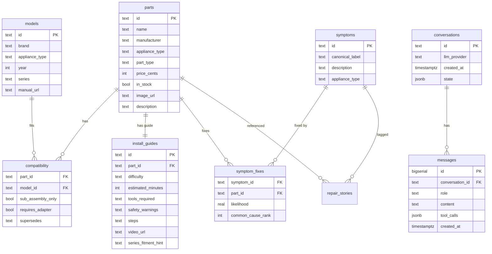

# Data model

Two synchronized representations of the same world.

- **Postgres** (Supabase) is the source of truth for compatibility verdicts,
  catalog browsing, and persisted conversations.
- **NetworkX KG** is derived from Postgres on boot and serialized to
  `data/kg.json` for fast multi-hop traversal in Python. Production target:
  Neo4j behind the existing `KnowledgeGraph` protocol.

For full design rationale see [../architecture.md §4](../architecture.md).
Schema DDL: [../backend/app/db/schema.sql](../backend/app/db/schema.sql).
KG schema: [../backend/app/kg/schema.py](../backend/app/kg/schema.py).

---

## Postgres tables (10)

| Table | Role | Approx rows (seed) |
|---|---|---|
| `parts` | Catalog row, one per SKU. | 50 |
| `models` | Appliance models with `brand` and `series`. | 21 |
| `compatibility` | Workhorse edge: `(part_id, model_id)` + fitment metadata. | 38 |
| `symptoms` | Canonical symptom taxonomy. `SY_ICE_MAKER_NOT_WORKING` etc. | 10 |
| `symptom_fixes` | Edge: `Part FIXES Symptom` with `likelihood` and `common_cause_rank`. | 28 |
| `install_guides` | One per part, with `steps`, `tools_required`, `series_fitment_hint`. | 10 |
| `repair_stories` | Hybrid-RAG corpus (Phase 2 retrieval). | seeded for future use |
| `conversations` | Per-session container with `state` JSONB carrying `last_part`, `model_number`, `brand`, `appliance_type`. | live |
| `messages` | One row per user / assistant / tool message. `tool_calls` JSONB preserves the tool-calling shape on replay. | live |
| `tickets` | Escalation target. `contact_blob` JSONB carries PII; the LLM only sees the ticket id. | live |

### Sample rows

`parts`:

```
id            | name                              | manufacturer | appliance_type | part_type        | price_cents | in_stock
--------------+-----------------------------------+--------------+----------------+------------------+-------------+----------
PS11752778    | Refrigerator Ice Maker Assembly   | Whirlpool    | refrigerator   | ice_maker        | 17999       | t
PS11743427    | Dishwasher Water Inlet Valve      | Whirlpool    | dishwasher     | water_inlet_valve| 4799        | t
```

`compatibility` (positive edge):

```
part_id       | model_id     | sub_assembly_only | requires_adapter | supersedes
--------------+--------------+-------------------+------------------+-----------
PS11743427    | WDT780SAEM1  | f                 | f                | NULL
```

`symptoms`:

```
id                          | canonical_label              | appliance_type
----------------------------+------------------------------+----------------
SY_ICE_MAKER_NOT_WORKING    | ice maker not working        | refrigerator
SY_DW_NOT_FILLING           | dishwasher not filling       | dishwasher
```

`symptom_fixes` (KG `FIXES` edge):

```
symptom_id                  | part_id     | likelihood | common_cause_rank
----------------------------+-------------+------------+------------------
SY_ICE_MAKER_NOT_WORKING    | PS11752778  | 0.60       | 1
SY_ICE_MAKER_NOT_WORKING    | PS11757654  | 0.20       | 2
```

### ER diagram



### Indexes worth knowing about

| Index | Why |
|---|---|
| `parts_id_trgm_idx` (GIN on `gin_trgm_ops`) | Powers `lookup_part` fuzzy SKU search via `pg_trgm`. |
| `parts_appliance_idx` | Filters by appliance type for scope checks. |
| `models_series_idx` | Powers the "inferred" compatibility branch (series-hint match). |
| `compat_part_idx`, `compat_model_idx` | Bidirectional edge lookup for the `check_compatibility` tool. |
| `messages_conv_idx` | History rehydration on conversation resume. |

### Why `symptoms` exist (FAQ)

User natural language is noisy ("ice maker stopped", "no ice coming out",
"ice maker dead"). All three map to `SY_ICE_MAKER_NOT_WORKING`. The
canonical id then has structured `symptom_fixes` edges to candidate parts
with `likelihood` and `common_cause_rank`. This is **why we don't just RAG
over repair articles** for the symptom-to-part step:

- Recommendations are auditable (we can show *which row* drove them).
- Multiple causes per symptom are first-class data, not buried in prose.
- Compound queries are short SQL joins, not multi-hop LLM reasoning.

---

## Knowledge graph (NetworkX)

The KG mirrors structured Postgres edges and adds derived facets
(`Brand`, `ApplianceType`) for fast traversal. **Postgres remains the
source of truth for compatibility verdicts.** The KG is rebuilt by
`scripts/build_kg.py` from Postgres tables and snapshotted to
`data/kg.json` (~33 KB, loads in <10 ms).

### Node types

```python
class NodeType(str, Enum):
    PART = "Part"
    MODEL = "Model"
    BRAND = "Brand"
    APPLIANCE_TYPE = "ApplianceType"
    SYMPTOM = "Symptom"
    INSTALL_GUIDE = "InstallGuide"
```

Brand and ApplianceType ids are prefix-namespaced (`brand:Whirlpool`,
`appliance:refrigerator`) so they cannot collide with part or model ids,
which are bare strings.

### Edge types

| Edge | Direction | Carries |
|---|---|---|
| `FITS` | Part -> Model | `sub_assembly_only`, `requires_adapter`, `supersedes` (mirrors `compatibility` table) |
| `MADE_BY` | Part \| Model -> Brand | - |
| `BELONGS_TO` | Model -> ApplianceType | - |
| `FIXES` | Part -> Symptom | `likelihood`, `common_cause_rank` (mirrors `symptom_fixes` table) |
| `OCCURS_IN` | Symptom -> ApplianceType | - |
| `INSTALLED_VIA` | Part -> InstallGuide | - |

### Current seed stats

```
Nodes (100): 50 Part + 21 Model + 10 Symptom + 10 InstallGuide + 8 Brand + 2 ApplianceType
Edges (178): 38 FITS + 28 FIXES + 71 MADE_BY + 21 BELONGS_TO + 10 OCCURS_IN + 10 INSTALLED_VIA
```

### Persistence: snapshot file

`backend/data/kg.json` is gitignored. Rebuild on first run:

```bash
python -m scripts.build_kg
```

The snapshot format is a `{nodes: [...], edges: [...]}` JSON; round-trip
verified by `scripts/smoke_kg.py` (11/11 PASS) which confirms enums
serialize correctly and edge metadata survives.

### Production: swap to Neo4j

The `KnowledgeGraph` protocol in
[../backend/app/kg/base.py](../backend/app/kg/base.py) defines the surface
every KG impl must satisfy. The Neo4j adapter is a single new file; tools
do not change. Use Cypher for traversals when scaling beyond what a
single-process NetworkX graph supports (rule of thumb: >100k edges or
multiple replicas needing shared state).

---

## Multi-hop query: `parts_fixing_symptom`

The KG-as-SQL multi-hop in
[../backend/app/db/repository.py](../backend/app/db/repository.py) is the
single query that powers Tool 5 (`find_parts_by_symptom`) and most of the
compound query path:

```sql
SELECT p.*, sf.likelihood, sf.common_cause_rank,
       c.model_id IS NOT NULL AS fits_model
FROM symptom_fixes sf
JOIN parts p ON p.id = sf.part_id
LEFT JOIN compatibility c
  ON c.part_id = p.id
 AND c.model_id = :model_id
WHERE sf.symptom_id = :symptom_id
ORDER BY (c.model_id IS NOT NULL) DESC,
         sf.common_cause_rank ASC,
         sf.likelihood DESC;
```

The `LEFT JOIN compatibility ON c.model_id = :model_id` produces a
`fits_model` boolean per candidate part, and the `ORDER BY` lifts
fitting parts to the top. One query, one round-trip, one auditable result
set. This is the design pattern that displaces graph traversal in
production.
