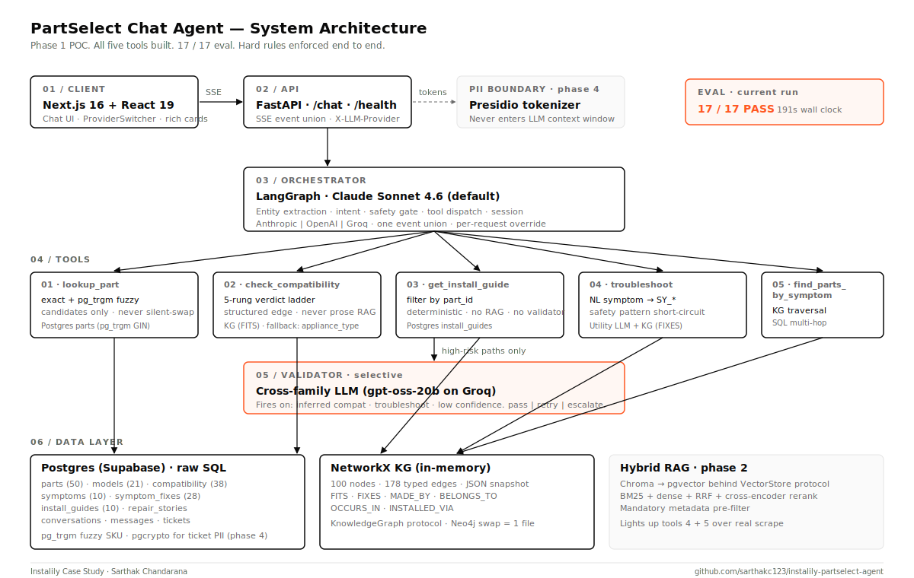

<!-- _class: title -->
<!-- _paginate: false -->

<div class="eyebrow">Case Study · May 2026</div>

# PartSelect Chat Agent

<p class="muted" style="font-size:24px; margin-top: 4px;">A production-grade customer-support agent for refrigerator and dishwasher parts.</p>

<br>

<p style="font-size: 14px; color: var(--muted); letter-spacing: 1px; margin-top: 120px;">PREPARED FOR <strong style="color: var(--brand)">INSTALILY</strong> · SARTHAK CHANDARANA</p>

---

<div class="eyebrow"><span class="num">01</span> The problem</div>

## Appliance parts support is slow, expensive, and brittle.

<div class="two-col">

<div>

**Live agent contacts cost $5 to $8 each.** Most are repeat questions:
*will this part fit my model?*

**Compatibility uncertainty is the top driver of cart abandonment** on parts
e-commerce. Customers leave when they can't get a confident *yes* or *no*.

**Returns from "wrong part" purchases compound the cost** with shipping and
restocking, and erode brand trust.

</div>

<div>

<p class="muted" style="font-size: 14px; letter-spacing: 1px;">FOUR QUESTION PATTERNS THAT MUST BE ANSWERED CORRECTLY <em>AND</em> EXPLAIN THEMSELVES</p>

| | |
|---|---|
| **Install** | *How do I install PS11752778?* |
| **Compatibility** | *Does this part fit my model?* |
| **Troubleshoot** | *My ice maker is broken, what part?* |
| **Compound** | *Symptom + model + install in one turn.* |

</div>

</div>

---

<div class="eyebrow"><span class="num">02</span> The real test</div>

## If the compound query works, the others fall out for free.

<br>

<blockquote style="font-size: 28px; font-style: normal; color: var(--brand); border-left-color: var(--accent);">
"Ice maker on my Whirlpool WRF555SDFZ is broken — what part do I need, and how do I install it?"
</blockquote>

<br>

One user message. Four tool calls in a single turn:

<table style="margin-top: 12px;">
<tr><td><span class="pill">01</span> <code>troubleshoot</code></td><td>Natural language → canonical symptom → ranked candidates</td></tr>
<tr><td><span class="pill">02</span> <code>find_parts_by_symptom</code></td><td>KG traversal, annotated with model fitment</td></tr>
<tr><td><span class="pill">03</span> <code>check_compatibility</code></td><td>Structured edge verdict</td></tr>
<tr><td><span class="pill">04</span> <code>get_install_guide</code></td><td>Deterministic step-by-step</td></tr>
</table>

<p style="margin-top: 18px;" class="muted">Verdict <span class="verdict-yes">YES</span>. Validator gates the recommendation. UI renders product + compat + install in one bubble.</p>

---

<div class="eyebrow"><span class="num">03</span> System architecture</div>

## One orchestrator. Five typed tools. Selective validator.



---

<div class="eyebrow"><span class="num">04</span> Design choice · 01</div>

## Orchestrator + typed tools, not router-to-specialists.

<div class="two-col">

<div>

**Why this shape:**

- Every action is a typed Python function with a JSON Schema contract.
- The reviewer reads <code>tools/registry.py</code> and knows the entire action surface.
- No tool calls an LLM internally. Auditable, fast, regression-proof.
- Single conversational thread means session memory (<code>last_part</code>, <code>brand</code>, <code>model</code>) carries across turns without specialist coordination.

</div>

<div>

**Tradeoff named:**

Less *agentic*. We do not get emergent multi-agent behavior. For this domain that is the right trade: the failure cost of a hallucinated compatibility verdict outweighs the upside of a more creative agent.

<blockquote style="font-size: 16px; margin-top: 16px;">
"compatibility verdicts come from edges; prose inference is a marked, lower-confidence fallback."
</blockquote>

</div>

</div>

---

<div class="eyebrow"><span class="num">05</span> Design choice · 02</div>

## Knowledge graph as a structured backbone. Not GraphRAG.

<div class="two-col">

<div>

**Compatibility is a structured edge lookup.** It is never LLM reasoning over prose.

The verdict ladder (in order):

<table>
<tr><td><strong>1</strong></td><td>Missing entity</td><td><span class="muted">unknown · low</span></td></tr>
<tr><td><strong>2</strong></td><td>KG edge exists</td><td><span class="verdict-yes">yes · high</span></td></tr>
<tr><td><strong>3</strong></td><td>Cross-appliance</td><td><span class="verdict-no">no · high</span></td></tr>
<tr><td><strong>4</strong></td><td>Series-hint match</td><td><span class="verdict-inferred">inferred · medium</span></td></tr>
<tr><td><strong>5</strong></td><td>No edge</td><td><span class="verdict-no">no · medium</span></td></tr>
</table>

</div>

<div>

**The trick question:** is PS11752778 (refrigerator part) compatible with WDT780SAEM1 (dishwasher)?

Most agents say "no, I don't see a fitment". That's technically correct but unhelpful.

Our agent says:

<blockquote style="font-size: 16px;">
"PS11752778 is not compatible with your WDT780SAEM1, and the reason is an <strong>appliance type mismatch</strong>. PS11752778 is a refrigerator ice maker assembly. WDT780SAEM1 is a dishwasher."
</blockquote>

That's rung 3 firing. Inference path (rung 4) is marked and gated by the validator.

</div>

</div>

---

<div class="eyebrow"><span class="num">06</span> Design choice · 03</div>

## Six hard rules. Enforced in code, verified in the eval.

<table>
<tr><td><span class="num">01</span></td><td><strong>No em dashes</strong> in any user-facing text.</td><td class="muted">eval asserts U+2014 absent in every reply</td></tr>
<tr><td><span class="num">02</span></td><td><strong>PII never enters the LLM context.</strong></td><td class="muted">Presidio inbound · ticket form bypass · log redaction</td></tr>
<tr><td><span class="num">03</span></td><td><strong>Compatibility verdicts from structured edges.</strong></td><td class="muted">verdict ladder; prose inference marked + gated</td></tr>
<tr><td><span class="num">04</span></td><td><strong>Safety symptoms short-circuit to escalation.</strong></td><td class="muted">regex pre-empts LLM and KG</td></tr>
<tr><td><span class="num">05</span></td><td><strong>Fuzzy SKU matches require user confirmation.</strong></td><td class="muted">repo returns <code>list[Part]</code>; never <code>Part</code></td></tr>
<tr><td><span class="num">06</span></td><td><strong>Validator never silently passes a failure.</strong></td><td class="muted"><code>pass | retry | escalate</code>, retry cap of 1</td></tr>
</table>

<p style="margin-top: 24px;" class="muted">These are the failure modes that get a vendor fired. Getting them right is what unblocks enterprise sales.</p>

---

<div class="eyebrow"><span class="num">07</span> Design choice · 04</div>

## Provider-agnostic LLM gateway. Insurance, not lock-in.

<div class="two-col">

<div>

One normalized event union:

```
TextDelta | ToolCall* | Usage | Done | StreamError
```

Same orchestrator code runs on Anthropic, OpenAI, and Groq behind a single <code>LLMProvider</code> protocol.

Per-request <code>X-LLM-Provider</code> header flips providers mid-conversation. The frontend ProviderSwitcher writes it; the reviewer can flip live in the demo.

</div>

<div>

**Insurance benefits:**

- **Rate-limit resilience.** Groq 429 in production? Switch to Anthropic; user never sees it.
- **Cross-family validator.** Validator uses a different family from the orchestrator. Diversity catches errors one family makes that another does not.
- **Cost flexibility.** Cheap Groq for utility role (symptom mapping); premium for orchestrator.
- **No vendor lock-in.** A new model from a new provider is one file.

</div>

</div>

---

<div class="eyebrow"><span class="num">08</span> Eval results</div>

## <span class="big-accent">17 / 17</span> on the case-study eval.

<div class="two-col">

<div>

<p class="muted" style="font-size: 13px; letter-spacing: 1px;">PASS RATE BY CATEGORY</p>

| Category | Cases | Result |
|---|---|---|
| Install | 2 | <span class="verdict-yes">PASS</span> |
| Compatibility (all 5 verdict rungs) | 5 | <span class="verdict-yes">PASS</span> |
| Troubleshoot | 1 | <span class="verdict-yes">PASS</span> |
| Compound (the real test) | 1 | <span class="verdict-yes">PASS</span> |
| Edge (fuzzy, case, missing, safety) | 4 | <span class="verdict-yes">PASS</span> |
| Out-of-scope | 2 | <span class="verdict-yes">PASS</span> |
| Adversarial (prompt injection) | 1 | <span class="verdict-yes">PASS</span> |
| Validator (selective trigger) | 1 | <span class="verdict-yes">PASS</span> |

</div>

<div>

<p class="muted" style="font-size: 13px; letter-spacing: 1px;">METHODOLOGY</p>

**Deterministic checks**, not LLM-as-judge. Every assertion is a Python predicate over tool payloads and final text. Regressions are actionable: a failed <code>p.verdict == 'yes'</code> tells you exactly which row in the ladder broke.

**191 seconds** wall clock total (Anthropic orchestrator + Groq validator).

Every reply printed verbatim in the eval report so fluency and tone are reviewable too.

<br>

<p class="muted" style="font-size: 14px;">docs/eval_results.md</p>

</div>

</div>

---

<div class="eyebrow"><span class="num">09</span> Business impact</div>

## A focused agent unlocks three categories of value.

<div class="two-col">

<div>

<p class="muted" style="font-size: 13px; letter-spacing: 1px;">DEFLECTION</p>

<p class="big-accent">~$1.8M</p>

<p class="muted">illustrative annual operating cost reduction at 50k/month contacts × 60% deflection × $6 saved per deflected contact.</p>

<hr>

<p class="muted" style="font-size: 13px; letter-spacing: 1px;">CONVERSION LIFT</p>

A confident, **explained** yes/no/inferred compatibility verdict directly recovers cart abandonment from compatibility uncertainty — the largest single contributor on parts sites.

</div>

<div>

<p class="muted" style="font-size: 13px; letter-spacing: 1px;">ENTERPRISE-SALES UNLOCK</p>

PII never leaves the boundary. Safety symptoms always escalate. These are the failure modes that get a vendor *removed* from a procurement shortlist.

Getting them right is **table stakes for closing PartSelect-scale customers**, and they are already enforced in the POC.

<hr>

<p class="muted" style="font-size: 13px; letter-spacing: 1px;">TIME TO VALUE</p>

50 parts seeded synthetically. A real catalog ingest swaps the data, not the architecture. Phase 2 is *scrape-and-load*, not *rebuild*.

</div>

</div>

---

<div class="eyebrow"><span class="num">10</span> Scaling roadmap</div>

## Architecture has explicit seams. Each phase is a drop-in.

<table>
<tr><th style="width: 90px;">PHASE</th><th>What</th><th>How it slots in</th></tr>
<tr>
  <td><span class="pill pill-accent">02</span></td>
  <td><strong>Real PartSelect scrape</strong> + hybrid RAG (BM25 + dense + RRF + rerank) over repair stories.</td>
  <td><code>VectorStore</code> protocol → Chroma → pgvector swap. Scraper hits same Postgres schema.</td>
</tr>
<tr>
  <td><span class="pill pill-accent">03</span></td>
  <td><strong>Validator expansion</strong>: every troubleshoot recommendation and every inferred compat now grades.</td>
  <td>One conditional edge in <code>graph.py</code>. Validator already built.</td>
</tr>
<tr>
  <td><span class="pill pill-accent">04</span></td>
  <td><strong>Production hardening:</strong> per-IP rate limit, provider fallback chain, Neo4j swap, LangSmith tracing, PagerDuty on hard-rule violations.</td>
  <td><code>KnowledgeGraph</code> protocol → Neo4j is one file. FastAPI is stateless; session in Postgres; KG snapshot loads in &lt;10ms.</td>
</tr>
<tr>
  <td><span class="pill pill-accent">05</span></td>
  <td><strong>Hosted demo</strong> on Vercel (frontend) + Fly.io (backend) + Supabase pooler.</td>
  <td>Already env-driven. <code>NEXT_PUBLIC_BACKEND_URL</code> + <code>CORS_ORIGINS</code>.</td>
</tr>
</table>

---

<!-- _class: title -->
<!-- _paginate: false -->

<div class="eyebrow">Thanks for reading</div>

# Happy to walk through the code live.

<br>

<p class="muted" style="font-size: 18px;">Source · README · run instructions · eval report · architecture doc</p>

<p style="font-size: 18px; margin-top: 24px;">
github.com/<strong>sarthakc123/instalily-partselect-agent</strong>
</p>

<br>

<p style="font-size: 14px; color: var(--muted); letter-spacing: 1px; margin-top: 120px;">SARTHAK CHANDARANA · <strong style="color: var(--brand)">SARTHAK.CHANDARANA99@GMAIL.COM</strong></p>
